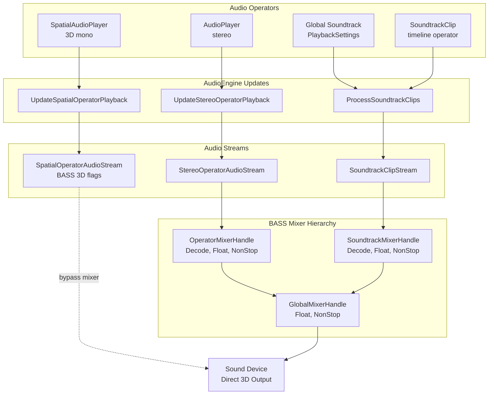
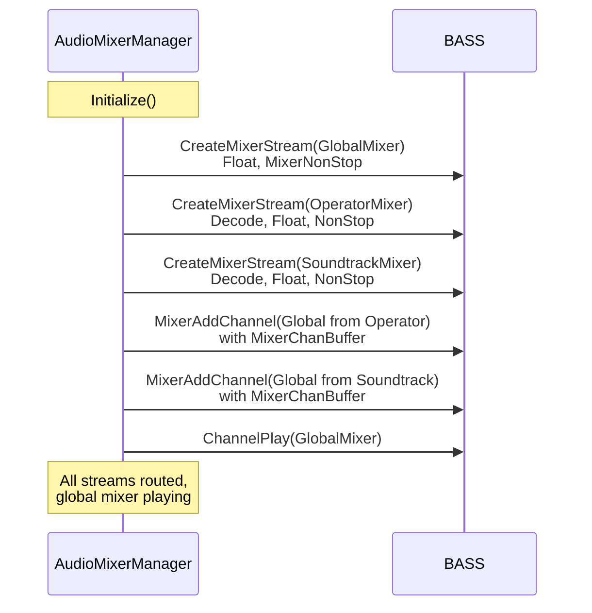
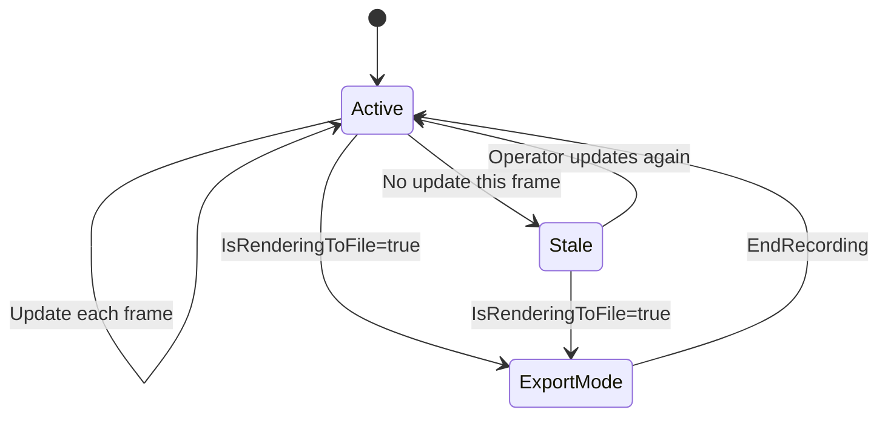
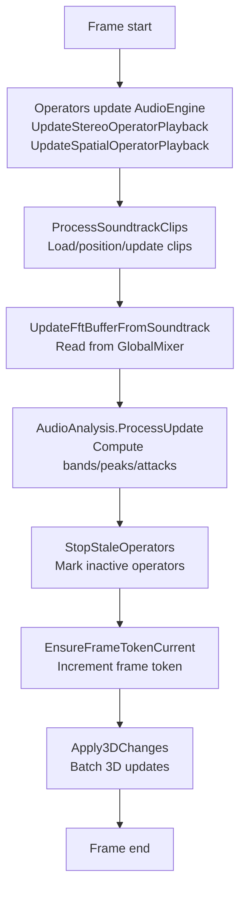
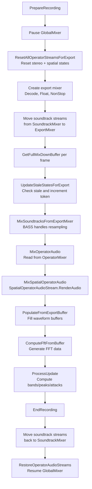
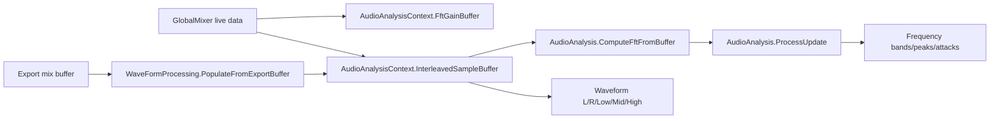

# Audio System Architecture

**Last Updated:** 2026-03-08

---

## 1) Scope and Source of Truth

This document describes the currently implemented audio runtime in `Core/Audio` and its integration points in `Operators` and `Editor`.

- **Code symbols are authoritative** - If prose and code disagree, the code is correct.
- **Coverage** - Live playback, export/rendering, and real-time analysis/metering.
- **Not covered** - Historical implementation details, future planned features, or alternative approaches.

### Primary source files

| Component | Files |
|-----------|-------|
| **Core Engine** | `AudioEngine.cs`, `AudioMixerManager.cs`, `AudioRendering.cs` |
| **Stream Types** | `OperatorAudioStreamBase.cs`, `StereoOperatorAudioStream.cs`, `SpatialOperatorAudioStream.cs`, `SoundtrackClipStream.cs` |
| **Analysis** | `AudioAnalysisContext.cs`, `AudioAnalysis.cs`, `WaveFormProcessing.cs`, `WasapiAudioInput.cs` |
| **Operators** | `Operators/Lib/io/audio/AudioPlayer.cs`, `SpatialAudioPlayer.cs`, `SoundtrackClip.cs` |
| **Editor** | `Editor/Gui/Windows/RenderExport/RenderProcess.cs`, `UiHelpers/UserSettings.cs`, `Windows/SettingsWindow.cs`, `Gui/Audio/AudioWaveformTextureCache.cs`, `Gui/Audio/AudioImageFactory.cs`, `Gui/Windows/TimeLine/TimeClips/SoundtrackClipItem.cs` |

### Verification Notes (v4.0)

Key architectural facts verified against codebase:
- ✅ **Three mixer handles** exist (Global, Operator, Soundtrack) - not four
- ✅ **No OfflineMixerHandle** - offline analysis uses standalone decode streams
- ✅ **Export uses temporary mixer** - created in `PrepareRecording()`, freed in `EndRecording()`
- ✅ **Spatial audio bypasses mixers** - uses direct BASS 3D streams to output
- ✅ **Frame token stale detection** - correctly described with export special handling
- ✅ **AudioAnalysisContext ownership** - all buffers owned by context instances
- ✅ **SoundtrackClip uses soundtrack mixer** - routes through `SoundtrackMixerHandle` via `UseSoundtrackClip()`, not operator mixer
- ✅ **SoundtrackClip initial sync** - `IsNew` flag forces immediate seek; `TargetTime` set on load; stream starts paused

---

## 2) Runtime Topology

### Live Playback Architecture



### Implementation Details

| Component | Key Details |
|-----------|-------------|
| **Mixer Creation** | `AudioMixerManager.Initialize()` creates all three mixers |
| **Stereo Routing** | `AudioPlayer` sends to `StereoOperatorAudioStream` to `OperatorMixerHandle` to `GlobalMixerHandle` |
| **Soundtrack Routing** | Global soundtrack and `SoundtrackClip` both send to `SoundtrackClipStream` to `SoundtrackMixerHandle` to `GlobalMixerHandle` |
| **SoundtrackClip Routing** | `SoundtrackClip` operator creates a `SoundtrackClipDefinition` with `DiscardAfterUse=false` and calls `AudioEngine.UseSoundtrackClip()` per frame; uses same `SoundtrackClipStream` path as global soundtrack |
| **Spatial Routing** | `SpatialAudioPlayer` sends to `SpatialOperatorAudioStream` to **Direct to device** (bypasses mixers) |
| **Mixer Flags** | Operator/Soundtrack: `Decode` (no direct output), Global: outputs to device |
| **3D Processing** | Spatial streams use `BassFlags.Bass3D` + `Bass.Apply3D()` for HRTF/attenuation |

---

## 3) Mixer Architecture

### Mixer Handles

| Handle | Flags | Purpose |
|---|---|---|
| `GlobalMixerHandle` | Float, MixerNonStop | Master output stream to the sound device |
| `OperatorMixerHandle` | MixerNonStop, Decode, Float | Decode mixer for stereo operator streams |
| `SoundtrackMixerHandle` | MixerNonStop, Decode, Float | Decode mixer for soundtrack streams |

### Mixer Configuration

All three mixers are created in `AudioMixerManager.Initialize()`:



### Important Implementation Notes

- **No OfflineMixerHandle** exists in `AudioMixerManager`
- **Offline analysis** uses standalone decode streams via `CreateOfflineAnalysisStream(...)` with `BassFlags.Decode | Prescan | Float`
- **Soundtrack sync behavior** - clips added with `MixerChanPause` (not `MixerChanBuffer`) to maintain accurate timeline position tracking
- **Level metering** - mixers use `MixerChanBuffer` flag for `BassMix.ChannelGetLevel()` access without consuming audio data
- **Sample rate** - all mixers use `AudioConfig.MixerFrequency` (auto-detected from WASAPI device)

---

## 4) Playback Semantics

### 4.1 Trigger and Seek Behavior

**Edge Detection:**
- `shouldPlay` and `shouldStop` use rising-edge detection in `AudioEngine` state handling
- Operators track `PreviousPlay` and `PreviousStop` to detect transitions
- Play trigger: `shouldPlay && !PreviousPlay`
- Stop trigger: `shouldStop && !PreviousStop`

**Seek Behavior:**
- `seek` parameter (0.0-1.0 normalized) is stored in `PendingSeek`
- Applied **only** on play trigger, not continuously during playback
- This allows setting seek position and play trigger in same frame for deterministic behavior

**Pause/Resume:**
- Explicit pause/resume handled separately from play/stop triggers
- `PauseOperator()` / `ResumeOperator()` / `PauseSpatialOperator()` / `ResumeSpatialOperator()`
- Pause state tracked independently in operator state

### 4.2 Stale Detection Lifecycle



### 4.3 Stale Detection Implementation

**Frame Token System:**
- Monotonic counter `_audioFrameToken` incremented each frame
- Each operator state has `LastUpdatedFrameId`
- Set to current token when operator calls `UpdateStereoOperatorPlayback` or `UpdateSpatialOperatorPlayback`

**Live Playback Flow:**
1. `CompleteFrame()` called at frame start
2. `StopStaleOperators()` checks if `LastUpdatedFrameId != _audioFrameToken`
3. Stale streams marked via `SetStale(true)` → pauses playback
4. `EnsureFrameTokenCurrent()` called at frame end to increment token
5. When stale operator updates again, `SetStale(false)` → can resume

**Export Flow:**
1. `PrepareRecording()` → `ResetAllOperatorStreamsForExport()` resets all states
2. Each export frame: `UpdateStaleStatesForExport()` checks staleness, then increments token
3. Stale detection runs but streams are NOT paused (handled in `SetStale()` export check)
4. `EndRecording()` → `RestoreOperatorAudioStreams()` restores live states

---

## 5) Live and Export Flow

### 5.1 Live Playback Flow



**Key Points:**
- Operators call update methods each frame with current parameters
- Soundtrack clips positioned/synced to timeline
- FFT/waveform data captured from `GlobalMixerHandle`
- Stale detection runs after all updates
- Frame token incremented to prepare for next frame
- 3D audio changes batched and applied once per frame for performance

### 5.2 Export Flow



**Export Behavior Notes:**
- Export driven by `AudioRendering.GetFullMixDownBuffer()` called from `RenderProcess.ComputeAudioBufferForVideoFrame()`
- **Temporary export mixer** created in `PrepareRecording()`, freed in `EndRecording()`
- **Stereo operators** read from `OperatorMixerHandle` via `Bass.ChannelGetData()`
- **Spatial operators** use `SpatialOperatorAudioStream.RenderAudio()` with software 3D attenuation/panning
- **Soundtrack clips** moved to export mixer for sample-accurate seeking and BASS-handled resampling
- **Analysis** uses same `AudioAnalysisContext.Default` as live playback for consistency
- **Stale detection** runs each export frame but streams not paused (export mode check in `SetStale()`)

---

## 6) Analysis and Metering Ownership



**Buffer Ownership:**
- All FFT and waveform buffers are owned by `AudioAnalysisContext` instances
- `AudioAnalysis` and `WaveFormProcessing` are static facades over `AudioAnalysisContext.Default`
- `AudioAnalysisContext.Default` is the singleton used by main thread audio update loop
- **Not thread-safe** - for multi-threaded analysis, create separate `AudioAnalysisContext` instances

**Key Buffers:**
- `FftGainBuffer` - Raw FFT gain values from BASS
- `InterleavedSampleBuffer` - Stereo PCM samples from BASS
- `FrequencyBands` - Computed frequency band values (configurable band count)
- `WaveformLeftBuffer` / `WaveformRightBuffer` - Separated L/R channels
- `WaveformLowBuffer` / `WaveformMidBuffer` / `WaveformHighBuffer` - Frequency-filtered waveforms

---

## 7) Operator Integration Contract

### `AudioPlayer` (`Operators/Lib/io/audio/AudioPlayer.cs`)

- Delegates playback state to `AudioEngine.UpdateStereoOperatorPlayback(...)`.
- Applies optional ADSR envelope (`AdsrCalculator`) to output volume before sending values to `AudioEngine`.
- Exposes `IsPlaying` and level queries from `AudioEngine`.
- Does not implement its own `RenderAudio()` method.

### `SpatialAudioPlayer` (`Operators/Lib/io/audio/SpatialAudioPlayer.cs`)

- Delegates playback state to `AudioEngine.UpdateSpatialOperatorPlayback(...)`.
- Updates listener transform each frame via `AudioEngine.Set3DListenerPosition(...)`.
- Uses mono + 3D BASS stream flags through `SpatialOperatorAudioStream`.
- Contains a helper `RenderAudio(...)` method that forwards to its stream when needed.

### `SoundtrackClip` (`Operators/Lib/io/audio/SoundtrackClip.cs`)

A timeline-coupled audio clip operator that uses the **soundtrack mixer routing** (not the operator mixer). It coexists with the global timeline soundtrack and allows placing multiple independent audio clips at arbitrary positions on the timeline.

**Key Design Differences from AudioPlayer:**

| Aspect | AudioPlayer | SoundtrackClip |
|--------|-------------|----------------|
| **Mixer routing** | OperatorMixerHandle | SoundtrackMixerHandle |
| **Timeline coupling** | Free-running or manual time | Locked to `TimeClipSlot` range |
| **Playback control** | Play/Stop/Pause triggers | Automatic via timeline position |
| **Time sync** | Operator's own time | `Playback.Current.TimeInSecs` (frame-perfect) |
| **Stream type** | `StereoOperatorAudioStream` | `SoundtrackClipStream` |
| **Discard behavior** | N/A | `DiscardAfterUse = false` (persists while in timeline) |

**Operator Implementation:**

```
SoundtrackClip : Instance<SoundtrackClip>, IPreventingTimeRemap
├── Output: TimeClipSlot<Command>     ← makes it a draggable timeline clip
├── Input: AudioFile (string)         ← path to audio file
├── Input: Volume (float)
├── Input: Mute (bool)
├── Input: Panning (float)            ← reserved for future use
└── Input: Speed (float)              ← reserved for future use
```

- Implements `IPreventingTimeRemap` so dragging the clip in the timeline does not remap its source time region.
- Uses `TimeClipSlot<Command>` output, which makes it appear as a draggable clip on the timeline, identical to `TimeClip`.
- Sets `TimeClip.UsedForRegionMapping = false` to link source and clip regions when dragging.

**Lifecycle Per Frame:**

1. `TimeClipSlot.UpdateWithTimeRangeCheck()` checks if `context.LocalTime` is within the clip's `TimeRange` (in bars).
   - If **outside** the range → `Update()` is never called → `UseSoundtrackClip()` not called → stream marked as not in use → paused by `ProcessSoundtrackClips()`.
   - If **inside** the range → `Update()` is called.
2. `Update()` creates or reuses an `AudioClipResourceHandle` wrapping a `SoundtrackClipDefinition`.
3. Sets `StartTime`/`EndTime` from `TimeClip.TimeRange` (in bars) and `Volume` every frame.
4. Calls `AudioEngine.UseSoundtrackClip(_currentAudioHandle, Playback.Current.TimeInSecs)`.
5. `ProcessSoundtrackClips()` in `AudioEngine.CompleteFrame()` routes the clip through `SoundtrackClipStream.UpdateSoundtrackTime()`.

**Timeline Sync Mechanism (frame-perfect playback):**

The `SoundtrackClip` achieves frame-perfect timeline sync by reusing the same `SoundtrackClipStream.UpdateSoundtrackTime()` method as the global soundtrack:

```
UpdateSoundtrackTime(playback):
  localTargetTimeInSecs = TargetTime - playback.SecondsFromBars(clip.StartTime)
  
  if localTargetTimeInSecs out of [0, LengthInSeconds) → pause stream
  if playbackSpeed == 0 → pause stream
  
  if soundDelta exceeds AudioResyncThreshold → resync via BassMix.ChannelSetPosition()
  
  On first frame (IsNew=true):
    - Force correct playback speed
    - Force immediate resync (bypass threshold)
    - Ensures mid-clip seek works on load
```

This means:
- **Paused playback** → stream pauses (no audio leaks).
- **Scrubbing** → no audio during scrub (`PlaybackSpeed == 0`), stream resyncs on play.
- **Playing forward/backward** → `UpdateSoundtrackPlaybackSpeed()` adjusts BASS frequency and direction.
- **Speed changes** → handled identically to global soundtrack via `playbackSpeedChanged` check.
- **Mid-clip entry** → `IsNew` flag forces immediate seek on first `UpdateSoundtrackTime()` call, preventing playback from position 0.

**Initial Load Sync:**

When `ProcessSoundtrackClips()` loads a new `SoundtrackClipStream`:
1. `TargetTime` is set immediately from `_updatedSoundtrackClipTimes` (not left at 0).
2. Stream starts **paused** in the mixer via `MixerChanPause`.
3. On the first `UpdateSoundtrackTime()` call, `IsNew = true` triggers:
   - `UpdateSoundtrackPlaybackSpeed(playback.PlaybackSpeed)` to set correct speed/direction.
   - Forced resync via `BassMix.ChannelSetPosition()` bypassing the normal threshold check.
4. This guarantees that placing the playhead mid-clip plays audio from the correct position.

**Waveform Visualization:**

`SoundtrackClip` clips are drawn by the dedicated `SoundtrackClipItem` class (not `TimeClipItem`), which provides audio-specific rendering:

1. `LayersArea` dispatches to `SoundtrackClipItem.DrawClip()` when `SoundtrackClipItem.IsSoundtrackClip()` matches (by symbol name + namespace).
2. `SoundtrackClipItem.TryDrawWaveformBackground()` reads the `AudioFile` input value from `Symbol.Child.Inputs` using GUID `c4a1d5e2-8f3b-4c6a-9e1d-7b2a5f8c3d4e`.
3. Creates a temporary `AudioClipResourceHandle` and calls `AudioWaveformTextureCache.TryGetShaderResourceView()`.
4. `AudioWaveformTextureCache` delegates to `AudioImageFactory.TryGetOrCreateImagePathForClip()`, which:
   - Returns cached image path if available.
   - Otherwise spawns `Task.Run()` → `AudioImageGenerator.TryGenerateSoundSpectrumAndVolume()` to generate a PNG.
5. The PNG is loaded as a `ShaderResourceView` via `ResourceManager.CreateTextureResource()` and drawn via `ImGui.AddImage()`.
6. A subtle tint overlay preserves audio-themed color identity over the waveform imagery.
7. Additional audio-specific visual elements: music note icon, audio file name as label, volume indicator bar along bottom edge.
8. Audio-specific tooltip shows: file name, volume/mute state, and timeline range.

**Coexistence with Global Soundtrack:**

Both the global soundtrack (from `PlaybackSettings.AudioClips`) and `SoundtrackClip` operators share the same code path:
- Both call `AudioEngine.UseSoundtrackClip()` per frame.
- Both produce `SoundtrackClipStream` instances in `AudioEngine.SoundtrackClipStreams`.
- Both route through `SoundtrackMixerHandle` → `GlobalMixerHandle`.
- The key difference: global soundtrack clips use `DiscardAfterUse = true` (cleaned up when not registered); `SoundtrackClip` uses `DiscardAfterUse = false` (persists, paused when outside clip range).

---

## 8) Configuration and Logging Ownership

| Concern | Owner |
|---|---|
| Mixer sample rate and audio constants | `Core/Audio/AudioConfig.cs` |
| Runtime gated log enable flags | `Editor/Gui/UiHelpers/UserSettings.cs` + `Logging/Log.cs` |
| Settings UI toggles | `Editor/Gui/Windows/SettingsWindow.cs` |
| Log initialization | `UserSettings.InitializeGatedLogging()` |

### Clarifications

- `AudioConfig` does not define `ShowAudioLogs`, `ShowAudioRenderLogs`, or `LogAudioDebug/Info` wrapper methods.
- Gated logging is controlled via `Log.Gated` flags initialized from user settings.

---

## 9) Current Gaps and Cautions

- `AudioExportSourceRegistry` currently has no `Register(...)` call sites, so `EvaluateAllAudioMeteringOutputs(...)` iterates an empty registry unless future code registers sources.
- This document intentionally avoids unimplemented placeholders and future-looking architecture claims.

---

## 10) Consistency Checklist for Future Updates

Before changing this file:

1. Verify each changed claim against at least one concrete symbol (file + method/property).
2. Re-check cross-section consistency: runtime topology, export flow, and analysis flow must use identical terminology.
3. Re-run targeted searches for removed/stale identifiers (for example `OfflineMixerHandle`, missing markdown references).
4. Confirm tables and Mermaid nodes match real handles and method names.
5. If behavior is intended but not implemented, mark it explicitly as intended and name the missing implementation location.

---

## 11) Lightweight Maintenance Workflow

- Update this document whenever one of these files changes: `AudioEngine.cs`, `AudioMixerManager.cs`, `AudioRendering.cs`, `SpatialOperatorAudioStream.cs`, `SoundtrackClipStream.cs`, `SoundtrackClip.cs`, `SoundtrackClipItem.cs`.
- Keep Mermaid diagrams as the primary architecture representation; keep prose short and tied to symbol names.
- During review, reject additions that are not code-verifiable.
